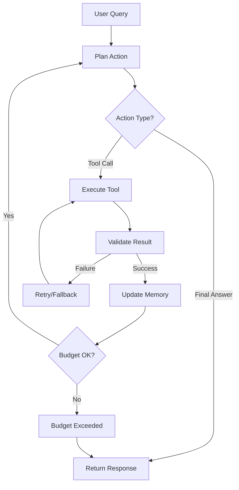

# Agent Orchestration Planner

Design robust multi-step agent systems with tools and error handling.

## Agent Architecture

```
User Query → Planning → Tool Selection → Tool Execution → Result Synthesis → Response
              ↓            ↓                ↓                    ↓
           Memory      Retry Logic      Validation         Cost Tracking
```

## Agent Loop Pattern

```python
from typing import List, Dict, Any

class Agent:
    def __init__(self, tools: List[Tool], max_iterations: int = 5):
        self.tools = tools
        self.max_iterations = max_iterations
        self.memory = []
        self.cost_tracker = CostTracker()

    def run(self, query: str) -> str:
        self.memory.append({"role": "user", "content": query})

        for iteration in range(self.max_iterations):
            # Decide next action
            action = self.plan_next_action()

            if action["type"] == "final_answer":
                return action["content"]

            # Execute tool
            result = self.execute_tool(action["tool"], action["params"])

            # Track cost
            self.cost_tracker.add(result["cost"])

            # Check budget
            if self.cost_tracker.exceeds_limit():
                return self.budget_exceeded_response()

            # Add to memory
            self.memory.append({
                "role": "tool",
                "tool": action["tool"],
                "result": result["data"]
            })

        return "Max iterations reached"

    def plan_next_action(self) -> Dict:
        prompt = self.build_planning_prompt()
        response = llm(prompt)
        return parse_action(response)
```

## Tool Orchestration

```python
TOOL_ORDER = {
    "search_web": 1,        # Always try search first
    "query_database": 2,    # Then database
    "call_api": 3,          # Then external APIs
    "generate_content": 4,  # Finally generate
}

def select_tools(query: str, available_tools: List[Tool]) -> List[Tool]:
    """Select and order tools based on query"""
    # Use LLM to select relevant tools
    tool_selection_prompt = f"""
    Given this query: "{query}"

    Which of these tools are needed? {[t.name for t in available_tools]}

    Return JSON array of tool names in execution order.
    """

    selected_names = json.loads(llm(tool_selection_prompt))
    selected_tools = [t for t in available_tools if t.name in selected_names]

    # Sort by predefined order
    selected_tools.sort(key=lambda t: TOOL_ORDER.get(t.name, 999))

    return selected_tools
```

## Retry & Fallback Logic

```python
def execute_with_retry(tool: Tool, params: Dict, max_retries: int = 3):
    """Execute tool with exponential backoff retry"""
    for attempt in range(max_retries):
        try:
            result = tool.execute(params)
            return {"success": True, "data": result}
        except ToolError as e:
            if attempt == max_retries - 1:
                # Try fallback tool
                fallback = get_fallback_tool(tool.name)
                if fallback:
                    return execute_with_retry(fallback, params, 1)

                return {"success": False, "error": str(e)}

            # Wait before retry
            time.sleep(2 ** attempt)

FALLBACK_TOOLS = {
    "search_web": "query_database",
    "call_api": "use_cached_data",
}
```

## State Management

```python
class AgentState:
    def __init__(self):
        self.memory = []
        self.tool_results = {}
        self.costs = 0.0
        self.iteration = 0

    def add_message(self, role: str, content: str):
        self.memory.append({"role": role, "content": content})

    def add_tool_result(self, tool_name: str, result: Any):
        self.tool_results[tool_name] = result

    def get_context(self) -> str:
        """Build context from memory for next LLM call"""
        return "\n".join([
            f"{msg['role']}: {msg['content']}"
            for msg in self.memory[-5:]  # Last 5 messages
        ])
```

## Budget & Cost Controls

```python
class CostTracker:
    def __init__(self, max_cost: float = 1.0):
        self.max_cost = max_cost
        self.total_cost = 0.0
        self.breakdown = {}

    def add(self, cost: float, category: str = "llm"):
        self.total_cost += cost
        self.breakdown[category] = self.breakdown.get(category, 0) + cost

    def exceeds_limit(self) -> bool:
        return self.total_cost >= self.max_cost

    def remaining(self) -> float:
        return self.max_cost - self.total_cost

# Use in agent
if cost_tracker.exceeds_limit():
    return f"Budget limit reached. Used ${cost_tracker.total_cost:.4f}"
```

## Orchestration Diagram



## Planning Prompt

```python
def build_planning_prompt(state: AgentState) -> str:
    return f"""
You are an agent that can use tools to answer questions.

Available tools:
{json.dumps([t.schema for t in tools], indent=2)}

Conversation history:
{state.get_context()}

Based on the conversation, decide your next action:
1. Call a tool (specify tool name and parameters)
2. Provide final answer

If calling a tool, respond with:
{{"action": "tool_call", "tool": "tool_name", "params": {{...}}}}

If providing final answer, respond with:
{{"action": "final_answer", "content": "your answer"}}

Think step by step about what information you need.
"""
```

## Multi-Agent Coordination

```python
class MultiAgentSystem:
    def __init__(self):
        self.agents = {
            "researcher": ResearchAgent(),
            "coder": CodeAgent(),
            "reviewer": ReviewAgent(),
        }

    def run(self, task: str):
        # Researcher gathers information
        context = self.agents["researcher"].run(task)

        # Coder generates solution
        code = self.agents["coder"].run(f"{task}\nContext: {context}")

        # Reviewer validates
        review = self.agents["reviewer"].run(f"Review this code:\n{code}")

        if review["approved"]:
            return code
        else:
            # Iterate with feedback
            return self.agents["coder"].run(
                f"Fix this code based on feedback:\n{review['feedback']}"
            )
```

## Best Practices

1. **Limit iterations**: Prevent infinite loops
2. **Budget controls**: Track and limit costs
3. **Tool validation**: Verify tool outputs
4. **Error handling**: Graceful fallbacks
5. **State persistence**: Save progress
6. **Observability**: Log all actions
7. **Human-in-loop**: Critical decisions

## Output Checklist

- [ ] Agent loop implementation
- [ ] Tool selection logic
- [ ] Retry & fallback strategies
- [ ] State management
- [ ] Cost tracking
- [ ] Budget limits
- [ ] Orchestration diagram
- [ ] Planning prompts
- [ ] Error handling
- [ ] Observability/logging
